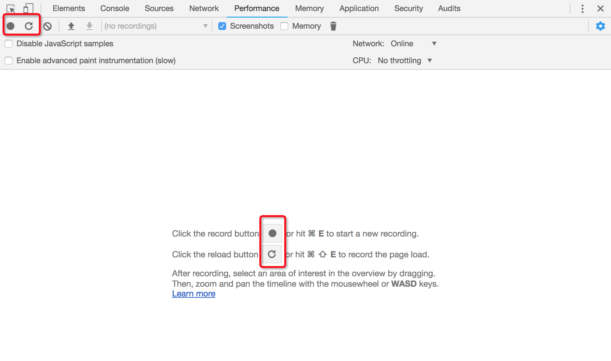
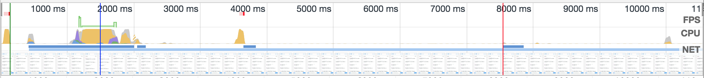
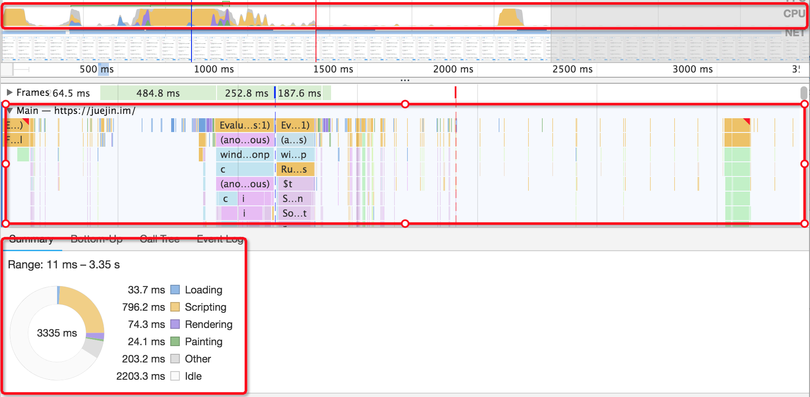
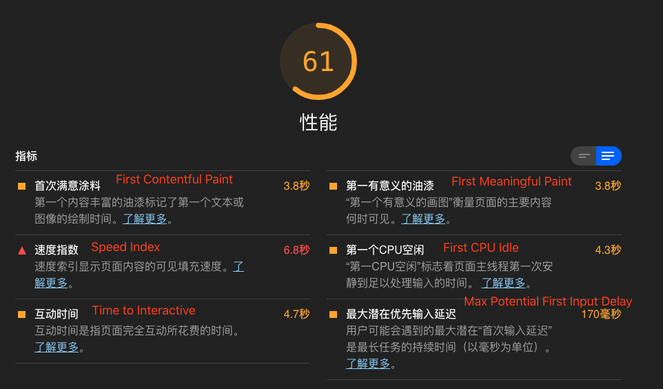
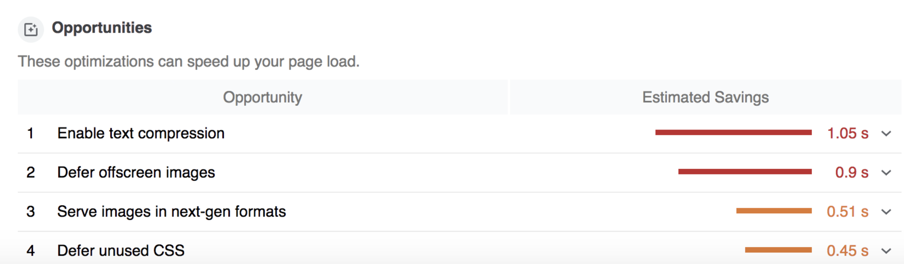

# Performance、LightHouse 和性能 API

### Performance

Chrome 开发者工具为我们提供了 Performance 的面板, 用来进行可视化性能检测. 如下图, 当我们点下实心圆按钮, Performance 面板就会帮我们记录接下来的交互操作. 当点下圆箭头按钮, Performance 将会把页面重新加载, 计算加载过程的性能表现.


> 使用 Performance 时, 为了避免其他 chrome 插件的影响, 建议使用无痕模式

Performance 面板分为概述面板和详情面板.

- 概述面板分为三块:
  
  - FPS: 和动画性能密切相关的一个指标, 他表示每一秒的帧数. 如图, 如果绿色柱状越高表示帧率越高, 动画体验越流畅. 如果出现红色块, 则代表长时间帧, 很可能出现卡顿.
  - CPU: 表示 CPU 的使用情况, 不同的颜色片段代表消耗 CPU 资源的不同事件类型. 这部分图像和下面的 Summary 内容有对应关系, 我们一般就是结合这两块来挖掘性能瓶颈.
  - NET: 粗略的表示各请求的耗时和前后顺序. 这个指标一般来说作用不大.

我们一般是看详情中的 Main 栏目下的火焰图和 Summary 饼图然后与概述面板中的 CPU 一栏结合, 进行性能瓶颈的挖掘. 以点下圆箭头为例分析:


### LightHouse

Performance 偏展示, 具体的分析工作需要用户自己做. 而 LightHouse 则是更加聪明, 他会给我们出具一个网站的性能报告, 我们可以根据这个报告进行网站的优化. <br />

#### LightHouse 有三种运行方式: chrome 扩展程序(需翻墙), chrome 开发工具 Audits(需翻墙), 命令行.

- 命令行:
  - npm install -g lighthouse
  - lighthouse https://juejin.im/books

> 扩展程序和命令行, 都是通过提供的一个需要审查网址, 单独运行出具的报告, 不会使用浏览器中的 cookie, 所以不适用于有登陆态的网页. Audits 则会保留当前网页的登陆态, 但是所有资源的加载都不会走缓存, 模拟的是首次加载.

#### LightHouse 报告分析


上述分别是页面性能, PWA(渐进式web应用), 可访问性(无障碍), 最佳实践, SEO五项指标的跑分.

上述是性能指标的详细化评估

上述是针对性能给出的操作建议以及每一个操作会节省的时间. 这份报告的可操作性是很强的, 我们可以根据这些建议一条条的去尝试, 就可以看到我们网站的性能在一秒秒的变快.

### 性能 api

W3C 规范为我们提供了 Performance 相关的接口, 它允许我们获取用户访问一个页面页面时每一个阶段的精确时间, 从而对页面性能进行分析.

- 性能 api 的意义: 将性能数据可编程化, 便于对其进行二次处理, 根据业务需要做一个更深层次的可视化.
- window.performance 即可获取到性能相关数据, 比如: memory, navigation, timing

  - timing, 可以看到某个页面加载关键时间节点的具体时间戳, 通过两个时间节点之间的差值, 就可以得到某个过程花费的时间.
    
    一些关键的性能指标:

    ```js
    // firstbyte: 首包时间
    timing.responseStart - timing.domainLookupstart;

    // fpt(first paint time): 首次渲染时间 / 白屏时间 (这里应该指的是html返回的时间)
    timing.responseEnd - timing.fetchStart;

    // tti(time to interact): 首次可交互时间
    timing.domInteractive - timing.fetchStart;

    // ready: html加载完成时间, 即DOM就位时间(这里是指html文件全部加载完成, 包括同步加载的js, css文件, 不包括图片, 视频文件)
    timing.domContentLoaded - timing.fetchStart;

    // load: 页面完全加载时间(所有同步异步的js, css, 图片资源全部加载完成. 不包括video、audio、flash等)
    timing.loadEventStart - timing.fetchStart;
    ```

    一些常用的耗时情况:

    ```js
    // DNS耗时
    timing.domainLookupEnd - timing.domainLookupStart;

    // TCP链接耗时
    timing.connectEnd - timing.connectStart;

    // 内容加载耗时
    timing.responseEnd - timing.responseStart;
    ```
