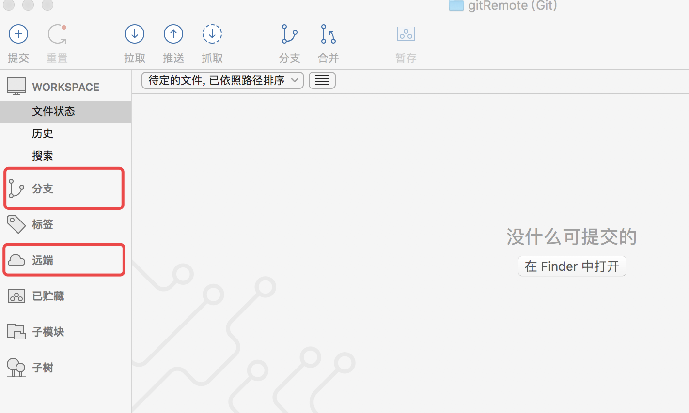
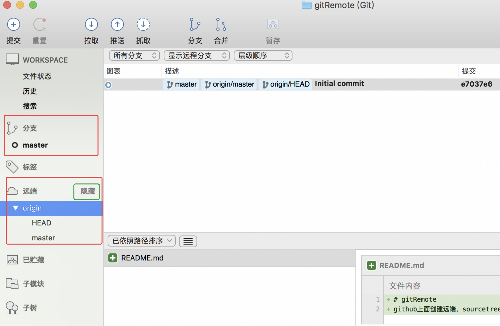

# myTest is for create GitHub Repository in SourceTree
### test1（本地仓库的创建）
##### &emsp; 注意事项
1. 本地仓库创建以后，不能同步到远程已有的仓库中，但是即使能，这个功能也是废，因为一般都是把远程仓库直接拉到本地，然后在本地改代码，然后同步到远程的。
##### &emsp; 结果
> 仓库创建成功，但无法和远程仓库关联，此功能暂时不知使用方法

### test2（远端仓库的创建）
##### &emsp; 注意事项
1. 远端仓库不能创建私有库，私有库是要花 $ 买的，所以一般个人都是创建的公共库
2. 远程仓库创建后，里面是没有任何文件的，所以下图所示，分支和远端中是没有任何数据的。正常当远程仓库创建完成后会在远端自动生成一个master主分支，但是如果里面没有任何文件的话，远端和分支都是呈不可见的形态。
    

3. 初始化状态的远程仓库中，master分支的激活方法。master分支之所以不可见，是因为里面没有文件，所以激活的方法就是向仓库中添加文件即可。对应的有两种方法：
    1. 在远端仓库中，选择创建ReadMe.md或是.gitignore等初始文件，在本地拉取命令的弹出框中的要拉去的远程分支选项上点击刷新，就会出现master分支了，这是可以点击确定，更新本地仓库。这是sourceTree中的远端选项右侧鼠标悬浮就会出现显示的字样，点击就会出现orgin分支，其下对应的会出现master分支。我们可以双击master分支，选择检出分支，就会在上面的分支选项中生成一个master的本地分支。
      
    

     

    2. 先在本地仓库创建一个文件，对应的就会先在分支栏目中，激活master分支，然后将这个分支推送到远程master分支上，这样在远端中，也就会出现master分支了。原理刚好和上述相反。

##### &emsp; 结果
> 成功

### test3（本地仓库的创建，同时创建远端仓库）
##### &emsp; 注意事项
1. 本地仓库会创建成功，但是远端仓库创建失败，最终结果和单独创建本地仓库是一样的
##### &emsp; 结果
> 失败

 

## 测试结论
&emsp; sourceTree中，不能同时创建本地和远端两个仓库，单次只能创建一个仓库。我们**正常GitHub仓库创建流程**是：

&emsp; **SourceTree来创建一个远程仓库** => **把这个远程库拉到本地** => **本地创建文件** => **将本地master分支推送到远程master分支**
