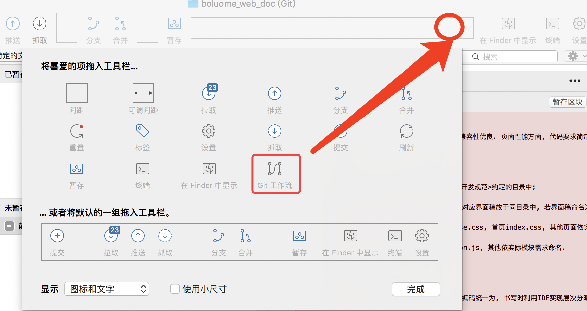
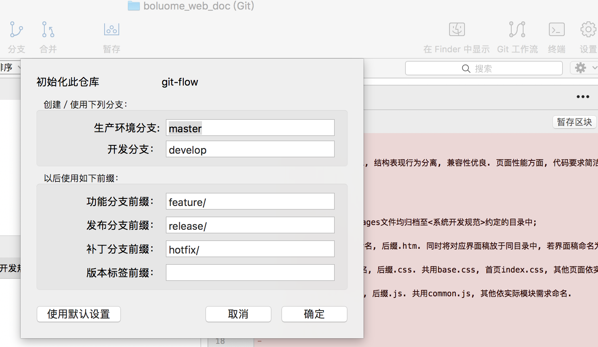
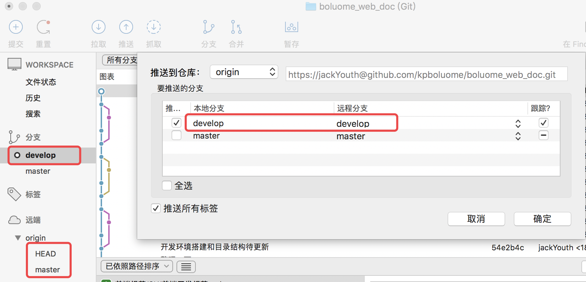

# Git Flow

### 概念
&emsp; git flow是基于git易于分支和合并的特点设计出来的一个项目开发模型，通过这个模型，我们可以很明确的完成项目的开发、发布和bug修复。
>&emsp; git flow建议使用工具SourceTree，因为SorceTree天然支持git flow，工具栏上就有对应的图标，如果没有，那么根据下图提示操作添加即可，在圆圈位置处右击，然后选择git flow图标拖到工具栏处即可
 

### git flow的初始化
&emsp; 第一次使用git flow会有一个初始化设置，直接确定，使用默认设置即可。

### git flow中的分支定义
&emsp; 从上图也可以看到，git-flow中将git的分支分成五大分支: **master**, **develop**, **feature**, **release**, **hotfix**。
##### &emsp; 永久分支
&emsp; 永久分支有两个：master，develop。我们之后的整个开发过程都会围绕着这两个分支进行操作，但是我们是不会直接在里面编写代码，这两个分支中的代码都是在通过其他分支合并过来的。
##### &emsp; 临时分支
&emsp; 临时分支有三个：feature, release, hotfix。一般在完成对应的功能并合并到对应分枝上后就会被删除。这三种分支刚好对应一个项目的 *开发*，*测试*，*线上*  这三个阶段时，对master和develop分支中代码进行改变的需求。

### master，develop分支的定义
##### &emsp; master（中文：主要）
&emsp; github创建一个仓库后，会自动生成一个master分支，拉取到本地以后，会在SourceTree中，左侧工具栏里的远端选项中显示，双击下面的master分支，将其作为本地分支检出到分支选项中。项目开发过程中，该分支中代码不能直接被改变，都是通过release或hotfix分支合并的方式，改变master分支中的代码内容。
##### &emsp; develop（中文：开发）
&emsp; develop分支，一般都是通过初始化git flow后，自动在本地生成的，然后再推送到远程仓库中，使远程仓库中也出现一个develop分支。项目开发过程中，该分支中代码不能直接被改变，一般都是通过feature，release或hotfix分支合并的方式，改变develop分支中的代码结构的。其中，最主要的是通过feature分支合并得到，其他两个临时分支是直接操作当前版本的项目，所以为了保持版本的同步，这两个临时分支会同时合并到master和develop分支上。
    

 

### feature, release, hotfix所担当的角色
##### &emsp; feature（ 中文：功能 ）
&emsp; feature分支主要用于项目的功能开发，在正常开发过程中，往往都是多人协调开发，每人负责一个功能或是模块，这时，就要在develop分支上派生出一个feature分支，用来开发单个功能。等到开发完成之后，再合并到develop分支上。**因为feature分支并不涉及到版本问题，所以命名时比较随意，描述清楚所开发的功能就行**。feature分支的开发是为了release分支的创建作准备的。
##### &emsp; release（ 中文：发布 ）
&emsp; release分支主要用于项目的发布，等到功能开发完毕之后，就需要准备发布了，这时就需要创建一个release分支，用于测试阶段，当测试通过以后，就把这个分支合并到master和develop分支上面。合并完之后再推到github上，如果使用了自动发布工具如daocloud，那么代码就会自动发布到服务器中。这样就完成了项目的发布工作。注意，这里**因为release分支是做为发布的版本，所以release分支在命名时要遵循版本命名规则**。
##### &emsp; hotfix（ 中文：补丁 ）
&emsp; hotfix分支主要用于线上环境突然出现bug了，用于紧急修复bug时使用的，常常被称作为**打补丁**。hotfix分支将来是要合并到master分支上的，其分支名称在合到master分支上的时候，会自动变成标签的形式保存下来，而**标签一般都是作为版本信息保存的，所以hotfix的命名也是要遵循版本命名规则**。

### 临时分支的创建
&emsp; 以hotfix分支的创建为例说明临时分支的创建流程。

### feature, release, hotfix的派生，合并

##### &emsp; feature（ 中文：功能 ）
&emsp; feature分支主要用于项目的功能开发，它派生于develop分支，合并至develop分支上。
##### &emsp; release（ 中文：发布 ）
&emsp; 派生于develop分支，合并至develop分支和master分支
##### &emsp; hotfix（ 中文：补丁 ）
&emsp; 派生于master分支，合并至develop分支和master分支
